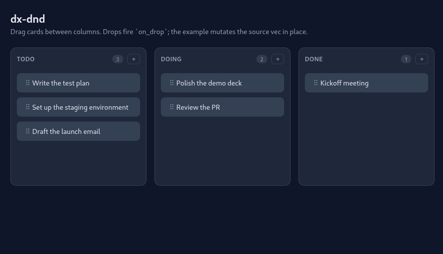

# Dioxus Drag and Drop

Multi-list drag-and-drop primitives for Dioxus 0.7, built on HTML5
native drag (`draggable="true"`, `ondragstart` / `ondragover` /
`ondrop` / `ondragend`). The browser owns the drag preview and end-of-
drag, so items can't get stranded. Works on desktop, iPad, and modern
Android — no polyfill.



## Components

```rust
use dioxus::prelude::*;
use dx_dnd::{DEFAULT_STYLE, DragDropArea, DragDropEvent, Draggable, DropList};

rsx! {
    document::Link { rel: "stylesheet", href: DEFAULT_STYLE }

    DragDropArea::<i64> {
        on_drop: move |evt: DragDropEvent<i64>| {
            // move lists[evt.from_list][evt.from_slot]
            //   to  lists[evt.to_list][evt.to_slot]
        },
        for (list_id, items) in lists {
            DropList {
                list_id: list_id.clone(),
                count: items.len(),
                for (idx, item) in items.iter().enumerate() {
                    Draggable::<i64> {
                        item_id: item.id,
                        list_id: list_id.clone(),
                        slot: idx,
                        "{item.label}"
                    }
                }
            }
        }
    }
}
```

`DEFAULT_STYLE` ships the classes the components rely on
(`.dnd-dz`, `.dnd-dz-hover`, `.dnd-dz-tail`, `.dnd-handle`). Skip it
if you supply your own.

## Hook (lower-level)

If you don't want the components, call `use_drag_drop` and wire the
handlers yourself:

```rust
use dx_dnd::{use_drag_drop, use_drag_drop_ctx, DragDropConfig, DragDropEvent, DropTargetCtx};

let dnd = use_drag_drop::<i64>(
    DragDropConfig::default(),
    move |evt: DragDropEvent<i64>| { /* mutate state */ },
);

// On each draggable item:
//   draggable: "true",
//   ondragstart: dnd.on_drag_start(item_id, list_id, slot),
//   ondragend:   dnd.on_drag_end(),
// On each drop zone (pulls DropTargetCtx from context):
//   ondragover: move |e| { e.prevent_default();
//                          ctx.set_drop_target.call((list_id, slot)); },
//   ondrop:     move |e| { e.prevent_default();
//                          ctx.commit_drop.call((list_id, slot)); },
```

## Example

```
cd examples/basic
dx serve --platform web
```

Three columns, drop targets above each item and at the tail.

## Status

Early. Not published.

## License

Dual-licensed under MIT ([LICENSE-MIT](LICENSE-MIT)) or
Apache-2.0 ([LICENSE-APACHE](LICENSE-APACHE)), at your option.

Contributions are accepted under the same dual license.
